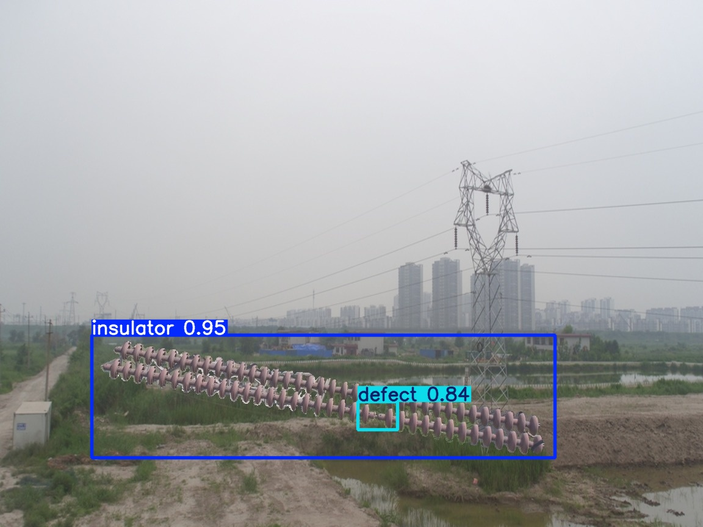
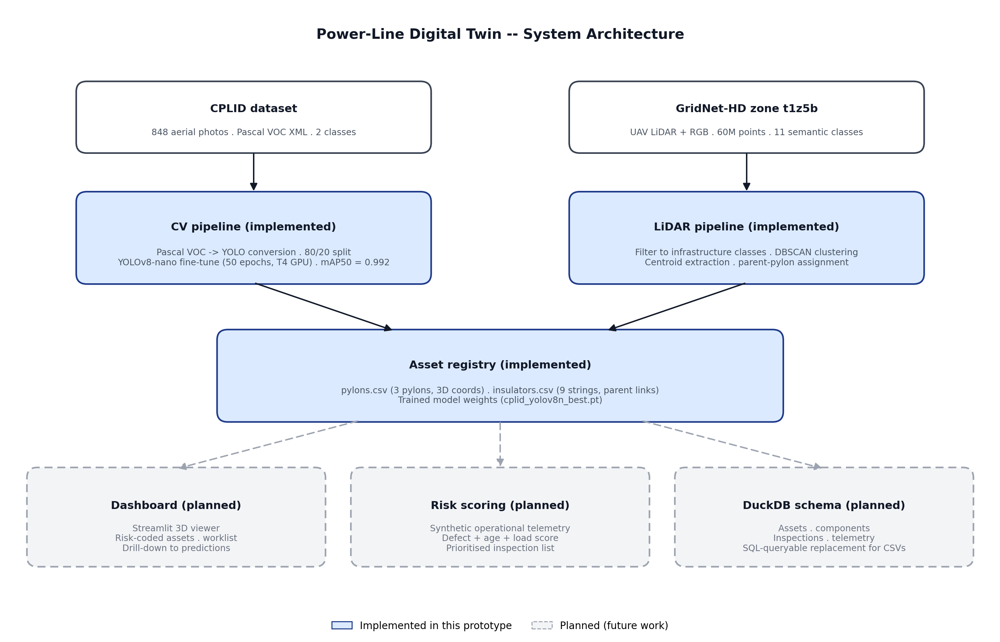
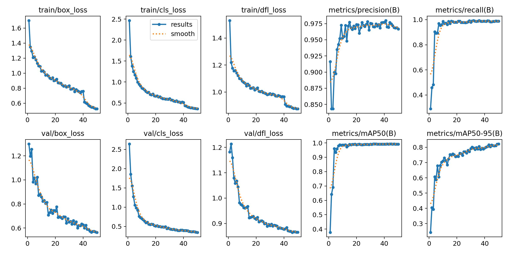
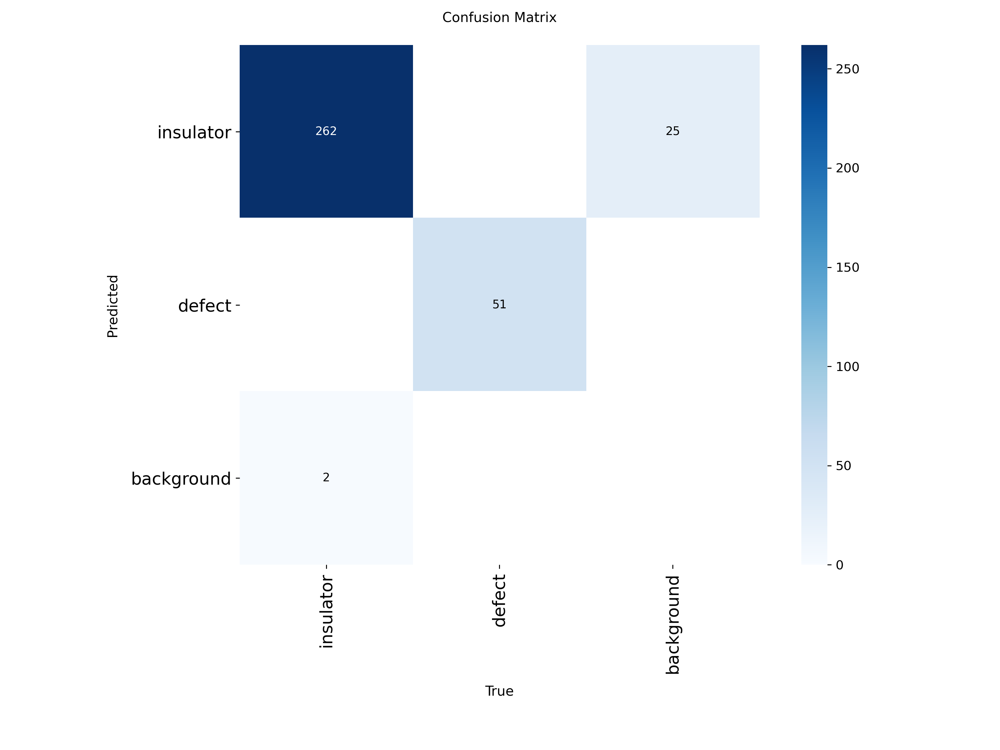
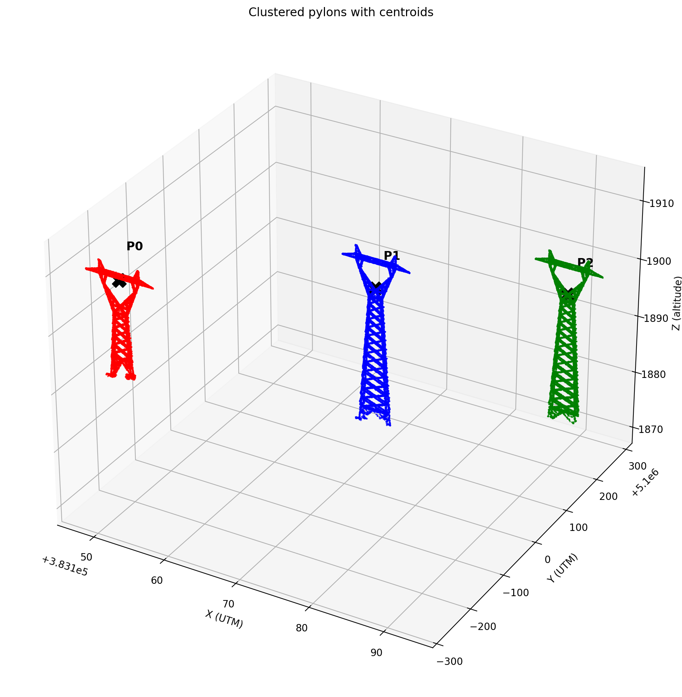

# Power-Line Digital Twin Prototype

> An AI-enabled Digital Twin prototype combining UAV LiDAR for 3D power-line asset extraction with computer vision for insulator defect detection.



## Motivation

Electrical transmission lines are inspected manually by climbing crews or helicopter overflights — slow, expensive, and risky. Recent UAV LiDAR and high-resolution imagery datasets make it possible to build digital replicas of grid infrastructure that can be inspected automatically by AI models. This project prototypes the two foundational layers of such a system: a 3D asset registry extracted from UAV LiDAR, and a computer vision model that detects faulty insulators from aerial inspection imagery.

The project implements the two hardest technical components end-to-end, with the integration layer and operational tooling sketched as next phases.

## What's Implemented

- ✅ **YOLOv8 insulator + defect detector** trained on the CPLID dataset (mAP50 = 0.992, 100% defect recall on validation set)
- ✅ **3D asset extraction pipeline** from the GridNet-HD multi-modal UAV LiDAR dataset, recovering pylon and insulator positions via DBSCAN clustering
- ✅ **Asset registry** (pylons.csv, insulators.csv) with 3D coordinates, parent-pylon assignment, and point counts

## Architecture



The full system architecture is shown above. **Blue components are implemented** in this prototype; **grey components are planned next phases**. The CV defect detector and the 3D asset extraction pipeline meet at the asset registry, which downstream components (dashboard, risk scoring, operational telemetry integration) would consume.

## Approach

### Dataset and asset model

Two open datasets are used, deliberately complementary:

- **CPLID** ([repo](https://github.com/InsulatorData/InsulatorDataSet)) — 848 aerial photos of power-line insulators, of which 248 contain missing-disc defects. Used to train the defect detector. Annotations are in Pascal VOC format with two classes (`insulator`, `defect`).
- **GridNet-HD** ([paper](https://arxiv.org/abs/2601.13052)) — a Swiss UAV LiDAR + RGB dataset of overhead electrical infrastructure. 2.5 billion points, 7,694 images, 36 acquisition zones. Provides the 3D geometry of pylons, conductor cables, structural cables, and insulators with 11-class semantic labels per point. This project uses one zone (`t1z5b`, ~60M points).

The two datasets are not physically linked — no insulator appears in both. They play complementary roles: GridNet-HD gives the 3D world (where assets are located in space), CPLID gives the inspection brain (a model that recognises defects in 2D imagery). In production, the CPLID model would be fine-tuned on the operator's own UAV inspection footage before being applied to images keyed to specific assets in the registry.

### Insulator defect detection

A YOLOv8-nano model (3M parameters) was fine-tuned on CPLID for 50 epochs on a single T4 GPU (~16 minutes total training time). Pascal VOC XML annotations were converted to YOLO format, with an 80/20 train/validation split.

Two-class detection (`insulator`, `defect`) was chosen over single-class because the Digital Twin needs to locate *all* insulators — not just the broken ones — for asset-level reporting.

### LiDAR-based asset extraction

The LAS point cloud is filtered to four infrastructure classes (pylon, conductor cable, structural cable, insulator), then DBSCAN clustering separates individual pylons and individual insulator strings. Centroids are computed on the full point set after using a downsampled cloud (every 20th point) for the clustering pass — a standard LiDAR-processing trade-off for memory tractability. Each insulator is assigned a parent pylon by Euclidean nearest-neighbour.

For zone `t1z5b`, the pipeline recovers 3 pylons and 9 insulator strings — exactly matching the visual count and consistent with a three-phase transmission line carrying three conductors per pylon.

## Results

### Defect detector — validation set performance

| Class | Precision | Recall | mAP@0.5 | mAP@0.5:0.95 |
|---|---|---|---|---|
| Insulator | 0.942 | 0.976 | 0.989 | 0.879 |
| Defect | 0.992 | 1.000 | 0.995 | 0.766 |
| **All** | **0.967** | **0.988** | **0.992** | **0.822** |

Training was stable with no overfitting (validation losses tracked training losses closely):



Confusion matrix shows no class confusion between insulator and defect detections:



### LiDAR asset registry — t1z5b

3 pylons, 9 insulators, separated by ~305m and ~243m for a total end-to-end span of ~548m:



Pylon centroids (UTM zone 32N):

| Pylon | X | Y | Z | Insulators |
|---|---|---|---|---|
| 0 | 383152.68 | 5099730.82 | 1905.13 | 3 |
| 1 | 383172.62 | 5100036.10 | 1895.59 | 3 |
| 2 | 383188.49 | 5100278.60 | 1888.06 | 3 |

## Limitations

- **CPLID's defective samples are synthetic composites.** The training data contains real insulator photos with defective sections cut from a small set of originals and pasted onto varying backgrounds. A model trained on CPLID will likely under-perform on real-world UAV inspection footage with different lighting, camera, and insulator hardware. Production deployment would require fine-tuning on the operator's own labelled footage.
- **Domain gap between CPLID and GridNet-HD imagery.** CPLID is medium-distance photos of Chinese transmission line insulators against varied backgrounds; GridNet-HD is high-resolution oblique drone imagery of Swiss alpine infrastructure. The trained detector has not been validated on GridNet-HD imagery; cross-dataset performance would need to be measured separately, and is expected to drop.
- **Single zone tested.** Asset extraction was validated on one GridNet-HD zone (`t1z5b`). The pipeline is parameterised for re-use across zones but the DBSCAN parameters (eps, min_samples) may need adjustment for very different terrain or pylon configurations.
- **No integration with operational data.** A real Digital Twin would integrate SCADA telemetry, historical inspection records, weather data, and load history. This prototype produces only the static asset geometry; the operational layer is in the future-work section.

## Future Work

In rough priority order:

1. **Decision-support dashboard** — Streamlit 3D viewer showing pylons colour-coded by simulated risk score, with a prioritised inspection worklist and drill-down to detector predictions on representative imagery.
2. **Synthetic operational telemetry** — per-asset attributes for age, load, last-inspection date; a composite risk score combining defect detection, age, and environmental factors.
3. **Detector evaluation on GridNet-HD imagery** — quantify the domain gap; explore fine-tuning approaches.
4. **Multi-zone scaling** — generalise the asset extraction pipeline across all 36 GridNet-HD zones.
5. **DuckDB-backed asset registry** — replace the CSV outputs with a queryable schema (assets, components, inspections, telemetry).

## How to Reproduce

### Requirements

Python 3.10+. See `requirements.txt`.

```bash
git clone https://github.com/VansheekaPachauree/power-line-digital-twin.git
cd power-line-digital-twin
python -m venv .venv
.venv/Scripts/Activate.ps1  # Windows; use source .venv/bin/activate on macOS/Linux
pip install -r requirements.txt
```

### Datasets

Two downloads are needed. Both are open and free:

- **CPLID:** `git clone https://github.com/InsulatorData/InsulatorDataSet.git` into the project root.
- **GridNet-HD zone t1z5b:** run `python download_zone.py` (uses `huggingface_hub.snapshot_download` to pull ~3.6 GB).

### Notebooks

Three notebooks document the pipeline in order:

1. `01_explore_data.ipynb` — exploration of CPLID and GridNet-HD structure, file formats, and label schemes.
2. `02_prepare_cplid.ipynb` — Pascal VOC → YOLO conversion, train/val split, dataset YAML.
3. `04_lidar_extraction.ipynb` — LAS loading, infrastructure filtering, DBSCAN clustering, centroid computation, CSV export.

Training (`03_train_yolo.ipynb`) is run separately on Google Colab with a T4 GPU; the notebook is included for reference.

## Acknowledgements

- **CPLID** — Dataset compiled by Wang Zi-Hao using imagery provided by the State Grid Corporation of China. Associated publication: Tao et al., "Detection of Power Line Insulator Defects Using Aerial Images Analyzed With Convolutional Neural Networks," IEEE Transactions on Systems, Man, and Cybernetics: Systems, 50(4):1486–1498, 2020. Dataset repo: [InsulatorData/InsulatorDataSet](https://github.com/InsulatorData/InsulatorDataSet).
- **GridNet-HD** — Carreaud et al., "GridNet-HD: A High-Resolution Multi-Modal Dataset for LiDAR-Image Fusion on Power Line Infrastructure," arXiv:2601.13052.
- **GridNet-HD** — Carreaud et al., "GridNet-HD: A High-Resolution Multi-Modal Dataset for LiDAR-Image Fusion on Power Line Infrastructure," arXiv:2601.13052.
- **Ultralytics** — YOLOv8 implementation.

